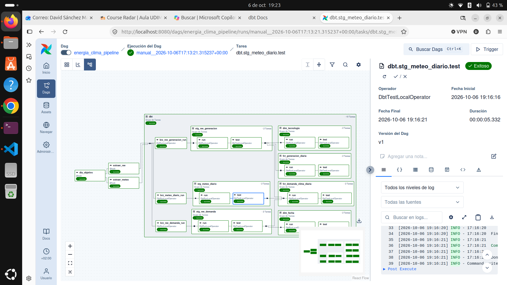
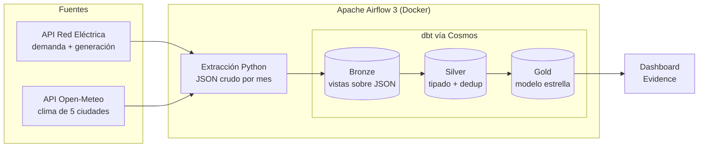

# ⚡ Energía y Clima en España — Pipeline de datos

Pipeline de datos de extremo a extremo que ingesta datos públicos de **demanda y generación eléctrica (Red Eléctrica)** y **meteorología (Open-Meteo)**, los modela en una **arquitectura medallion (bronze → silver → gold)** con **dbt**, y los orquesta diariamente con **Apache Airflow 3** y **Astronomer Cosmos**. Todo funciona en local, sin coste, sobre **DuckDB**.

**Pregunta de negocio:** ¿cómo afectan la temperatura y el calendario laboral a la demanda eléctrica en España, y cómo evoluciona el peso de las renovables en el mix?



---

## Arquitectura



## Stack

| Capa | Tecnología |
|---|---|
| Orquestación | Apache Airflow 3.3 (`standalone` + Postgres) en Docker |
| Integración dbt ↔ Airflow | Astronomer Cosmos (una tarea por modelo y test) |
| Transformación | dbt-core 1.12 + dbt-duckdb, `dbt_utils` |
| Almacén | DuckDB |
| Ingesta | Python (`requests`) con reintentos y backoff |
| Visualización | Evidence *(en desarrollo)* |

## Fuentes de datos

| Fuente | Datos | Granularidad |
|---|---|---|
| [apidatos.ree.es](https://www.ree.es/es/apidatos) | Demanda nacional y estructura de generación por tecnología | Diaria |
| [Open-Meteo Archive](https://open-meteo.com/en/docs/historical-weather-api) | Temperatura máx./mín./media y precipitación de Madrid, Barcelona, Valencia, Sevilla y Bilbao | Diaria |

Ambas APIs son públicas y no requieren API key.

## Modelo de datos

### Bronze: datos crudos
Vistas que leen directamente los ficheros JSON con `read_json_objects`. No se interpreta nada: el payload queda en una columna `JSON` junto con los metadatos de carga (`_source_file`, `_extracted_at`).

| Modelo | Origen |
|---|---|
| `brz_ree_demanda` | `data/raw/ree_demanda/*.json` |
| `brz_ree_generacion` | `data/raw/ree_generacion/*.json` |
| `brz_meteo_diario` | `data/raw/meteo_diario/*.json` |

### Silver: limpio y tipado
Desanidado con `unnest`, tipado con esquemas explícitos en `from_json` y deduplicado quedándose con la extracción más reciente por clave de negocio.

| Modelo | Grano |
|---|---|
| `stg_ree_demanda` | día |
| `stg_ree_generacion` | día × tecnología |
| `stg_meteo_diario` | día × ciudad |

### Gold: modelo en estrella

| Modelo | Tipo | Descripción |
|---|---|---|
| `dim_fecha` | Dimensión | Calendario con mes, día de la semana, fin de semana y estación |
| `dim_tecnologia` | Dimensión | Tecnologías de generación y si son renovables |
| `fct_demanda_clima_diaria` | Hechos | Demanda, temperatura media nacional, grados-día y % renovable por día |
| `fct_generacion_diaria` | Hechos | Generación en MWh y cuota del mix por día y tecnología |

**Calidad de datos:** 16 tests de dbt (unicidad, nulos, rangos, valores aceptados e integridad referencial), que se ejecutan después de cada modelo.

## Decisiones de diseño

- **Fechas como texto en silver.** REE devuelve marcas temporales con zona horaria (`2025-01-01T00:00:00+01:00`). Al inferirlas como timestamp, DuckDB las pasaba a UTC y desplazaba todos los días al anterior. Para evitarlo, se toma la fecha local de los 10 primeros caracteres del texto.
- **Bronze sin inferencia de tipos.** El JSON se guarda tal cual, y todo el tipado se hace de forma explícita en silver.
- **Extracción idempotente y autorreparable.** Hay un fichero por mes y fuente. Cada ejecución diaria vuelve a extraer desde el día 1 del mes de hace 7 días hasta ayer, de modo que los días que Open-Meteo publica con retraso se completan solos, incluso al cambiar de mes.
- **Un solo escritor en DuckDB.** El DAG usa `max_active_tasks=1`, porque DuckDB solo admite un proceso escribiendo a la vez.
- **dbt aislado de Airflow.** dbt vive en su propio entorno virtual dentro de la imagen, para evitar conflictos de dependencias. Cosmos lo invoca mediante `dbt_executable_path`.
- **Carga histórica separada del incremental.** El histórico se carga una vez con el script de extracción, y el DAG solo procesa el día a día. Un backfill de cientos de días a través de Airflow supondría cientos de ejecuciones completas de dbt.
- **Silver materializado como `table`.** Con este volumen, reconstruirlo entero tarda menos de un segundo. Un modelo incremental añadiría complejidad sin beneficio.
- **Portabilidad.** El SQL evita, en lo posible, funciones exclusivas de DuckDB, para poder añadir un target de Snowflake en `profiles.yml`.

## Estructura del repositorio

```
energia-clima-pipeline/
├── dags/
│   └── energia_clima_pipeline.py   # DAG diario con Cosmos
├── include/extract/
│   └── extract.py                  # Extractor REE + Open-Meteo
├── dbt_project/
│   ├── dbt_project.yml
│   ├── profiles.yml
│   ├── packages.yml
│   ├── macros/                     # read_raw, generate_schema_name
│   └── models/
│       ├── bronze/
│       ├── silver/
│       └── gold/
├── docs/                           # capturas
├── Dockerfile
├── docker-compose.yml
└── requirements.txt
```

## Cómo ejecutarlo

**Requisitos:** Docker con Compose v2, Python 3.12 y [uv](https://docs.astral.sh/uv/).

```bash
git clone git@github.com:davidsanchez-data/energia-clima-pipeline.git
cd energia-clima-pipeline

# 1. Entorno local
uv venv --python 3.12 && source .venv/bin/activate
uv pip install -r requirements.txt

# 2. Carga histórica
python include/extract/extract.py --start 2025-01-01 --end 2025-12-31

# 3. Transformación en local (opcional, sin Airflow)
cd dbt_project && dbt deps && dbt build && cd ..

# 4. Airflow
echo "AIRFLOW_UID=$(id -u)" > .env
mkdir -p logs
docker compose up -d --build
```

Abre http://localhost:8080, activa el DAG `energia_clima_pipeline` y lánzalo con **Trigger**.

Para explorar el linaje de los modelos:
```bash
cd dbt_project && dbt docs generate && dbt docs serve
```

## Hoja de ruta

- [x] Ingesta de APIs públicas a JSON crudo
- [x] Modelado medallion con dbt y tests de calidad
- [x] Orquestación diaria con Airflow 3 + Cosmos
- [ ] Dashboard en Evidence publicado en GitHub Pages
- [ ] Festivos nacionales en `dim_fecha`
- [ ] Target de Snowflake

---

**Autor:** [David Sánchez](https://github.com/davidsanchez-data)
